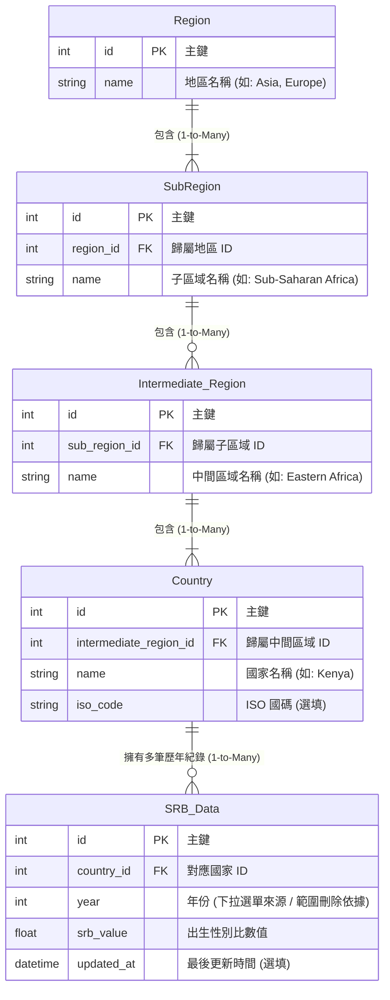

# M11405501_FinalExam

```mermaid
erDiagram
    %% ---------------------------------------------------------
    %% 1. 地區 (Region)
    %% 用於功能 3：選擇地區以顯示子區域統計
    %% ---------------------------------------------------------
    Region {
        int id PK "主鍵"
        string name "地區名稱 (如: Asia, Europe)"
    }

    %% ---------------------------------------------------------
    %% 2. 子區域 (SubRegion)
    %% 用於功能 2：選擇子區域顯示國家排行
    %% 用於功能 3：聚合計算該區域的最大 SRB
    %% ---------------------------------------------------------
    SubRegion {
        int id PK "主鍵"
        int region_id FK "歸屬地區 ID"
        string name "子區域名稱 (如: Sub-Saharan Africa)"
    }

    %% ---------------------------------------------------------
    %% 3. 中間區域 (Intermediate_Region) - 選用層級
    %% 如果資料來源包含此層級 (如 UN M49)，需加入此表
    %% ---------------------------------------------------------
    Intermediate_Region {
        int id PK "主鍵"
        int sub_region_id FK "歸屬子區域 ID"
        string name "中間區域名稱 (如: Eastern Africa)"
    }

    %% ---------------------------------------------------------
    %% 4. 國家 (Country)
    %% 用於功能 1：下拉選擇國家顯示歷年數據
    %% 用於功能 4：關鍵字搜尋國家名稱
    %% ---------------------------------------------------------
    Country {
        int id PK "主鍵"
        int intermediate_region_id FK "歸屬中間區域 ID"
        string name "國家名稱 (如: Kenya)"
        string iso_code "ISO 國碼 (選填)"
    }

    %% ---------------------------------------------------------
    %% 5. 出生性別比數據 (SRB_Data)
    %% 核心數據表，支援所有 SRB 數值的顯示與 CRUD 操作
    %% 功能 5 (新增下一年), 功能 6 (更新), 功能 7 (範圍刪除)
    %% ---------------------------------------------------------
    SRB_Data {
        int id PK "主鍵"
        int country_id FK "對應國家 ID"
        int year "年份 (下拉選單來源 / 範圍刪除依據)"
        float srb_value "出生性別比數值"
        datetime updated_at "最後更新時間 (選填)"
    }

    %% ---------------------------------------------------------
    %% 關係定義 (Relationships)
    %% ---------------------------------------------------------
    Region ||--|{ SubRegion : "包含 (1-to-Many)"
    SubRegion ||--o{ Intermediate_Region : "包含 (1-to-Many)"
    Intermediate_Region ||--|{ Country : "包含 (1-to-Many)"
    Country ||--o{ SRB_Data : "擁有多筆歷年紀錄 (1-to-Many)"
```