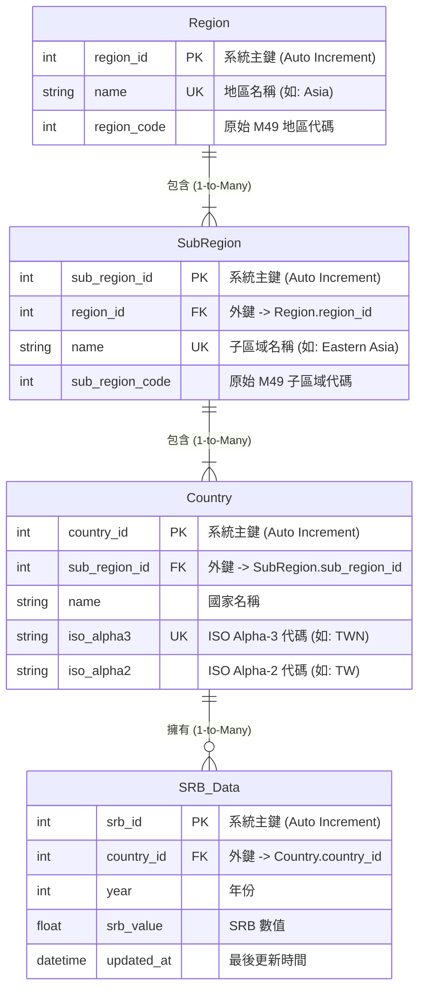

```mermaid
erDiagram
    %% =========================================================
    %% 1. 地區表 (Region)
    %% 用途：功能 3 (地區篩選)
    %% =========================================================
    Region {
        int region_id PK "系統主鍵 (Auto Increment)"
        string name UK "地區名稱 (如: Asia)"
        int region_code "原始 M49 地區代碼"
    }

    %% =========================================================
    %% 2. 子區域表 (SubRegion)
    %% 用途：功能 2 (子區域篩選)、功能 3 (聚合計算)
    %% =========================================================
    SubRegion {
        int sub_region_id PK "系統主鍵 (Auto Increment)"
        int region_id FK "外鍵 -> Region.region_id"
        string name UK "子區域名稱 (如: Eastern Asia)"
        int sub_region_code "原始 M49 子區域代碼"
    }

    %% =========================================================
    %% 3. 國家表 (Country)
    %% 用途：功能 1 (國家歷年數據)、功能 4 (關鍵字搜尋)
    %% =========================================================
    Country {
        int country_id PK "系統主鍵 (Auto Increment)"
        int sub_region_id FK "外鍵 -> SubRegion.sub_region_id"
        string name "國家名稱"
        string iso_alpha3 UK "ISO Alpha-3 代碼 (如: TWN)"
        string iso_alpha2 "ISO Alpha-2 代碼 (如: TW)"
    }

    %% =========================================================
    %% 4. 出生性別比數據表 (SRB_Data)
    %% 用途：核心數據展示、功能 5/6/7 (CRUD 操作)
    %% =========================================================
    SRB_Data {
        int srb_id PK "系統主鍵 (Auto Increment)"
        int country_id FK "外鍵 -> Country.country_id"
        int year "年份"
        float srb_value "SRB 數值"
        datetime updated_at "最後更新時間"
    }

    %% =========================================================
    %% 關係定義 (Relationships)
    %% =========================================================
    
    %% 一個地區包含多個子區域
    Region ||--|{ SubRegion : "包含 (1-to-Many)"
    
    %% 一個子區域包含多個國家
    SubRegion ||--|{ Country : "包含 (1-to-Many)"
    
    %% 一個國家擁有多筆年度數據
    Country ||--o{ SRB_Data : "擁有 (1-to-Many)"
```